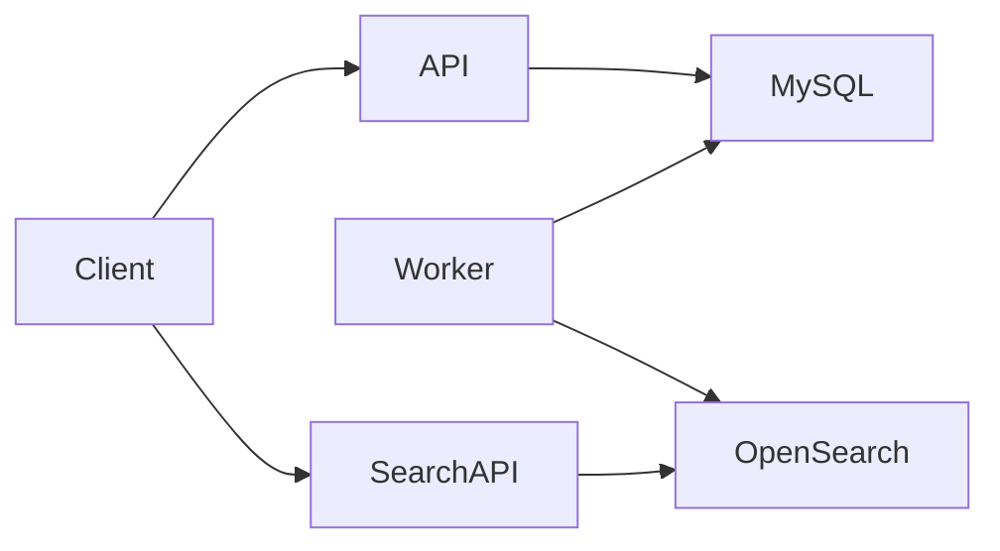
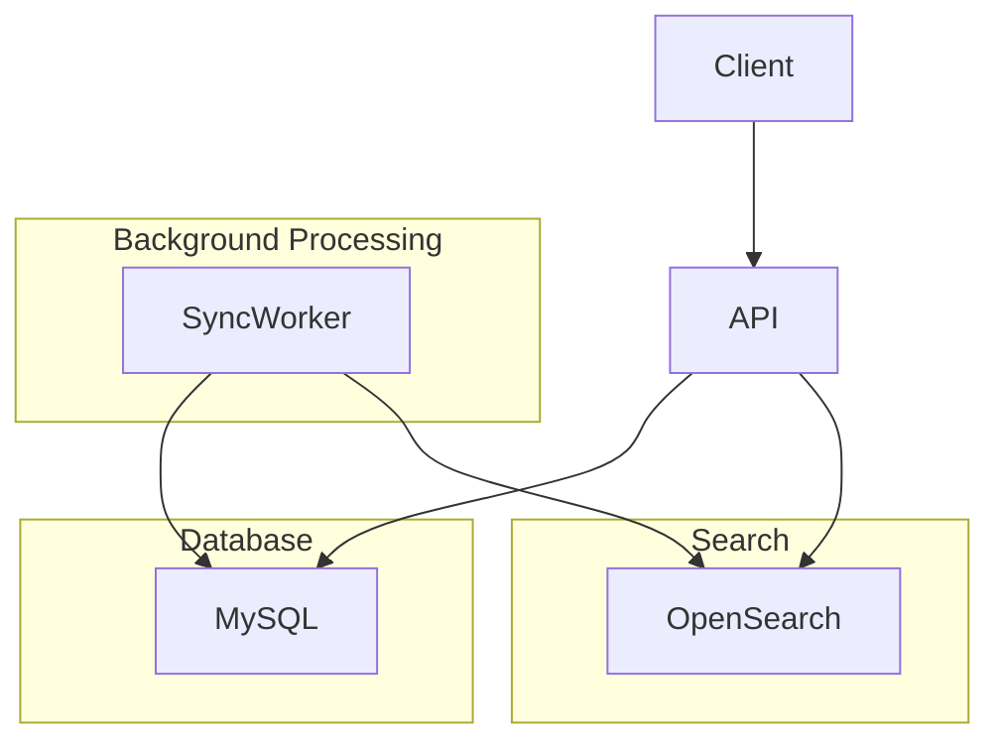

# Knowledge Hub / Indexer – Technical Documentation

## 1. Project Overview

### Purpose

Knowledge Hub is a document indexing and search service built in Go.

It allows external systems to:

- Store documents
- Update documents
- Delete documents
- Search indexed content

The system uses:

- MySQL as the source of truth
- OpenSearch as the search engine
- An asynchronous synchronization worker to keep OpenSearch updated.

---

## Main Features

| Feature | Description |
|----------|-------------|
| Document Upsert | Create or update documents |
| Document Delete | Remove documents |
| Full-text Search | Search indexed content |
| Namespace Isolation | Documents are separated by namespace |
| API Key Authentication | Access control for APIs |
| Async Indexing | OpenSearch updates occur via worker |
| Health Checks | Liveness endpoint |
| Readiness Checks | MySQL connectivity validation |

---

## Technology Stack

| Component | Technology |
|------------|------------|
| Language | Go 1.25 |
| Database | MySQL 8 |
| Search Engine | OpenSearch 3 |
| Database Access | sqlx |
| Migrations | golang-migrate |
| Authentication | API Keys |
| Deployment | Docker / Docker Compose |

---

## High-Level Architecture



---

## Main Components

| Component | Responsibility |
|------------|----------------|
| API Server | Receives requests |
| Documents Module | Document management |
| API Keys Module | Authentication |
| Sync Worker | Synchronizes MySQL → OpenSearch |
| OpenSearch Module | Search operations |
| Database Module | MySQL connectivity |
| Migration Tool | Database schema management |

---

## Available Endpoints

| Method | Endpoint |
|----------|----------|
| GET | `/health` |
| GET | `/ready` |
| GET | `/protected` |
| POST | `/documents/upsert` |
| DELETE | `/documents` |
| POST | `/search` |

---

## Operational Flow

### Document Upsert

```text
Client
  ↓
API
  ↓
MySQL
  ↓
Pending Sync
  ↓
Worker
  ↓
OpenSearch
```

### Search

```text
Client
  ↓
API
  ↓
OpenSearch
  ↓
Results
```

---

## Infrastructure Requirements

### MySQL

Used for:

- Documents
- API Keys
- Synchronization control

### OpenSearch

Used for:

- Full-text indexing
- Search queries

### Worker

Runs continuously and:

- Processes pending upserts
- Processes pending deletes
- Sleeps 5 seconds between cycles

---

## Health & Readiness

### Health

**Request**

```http
GET /health
```

**Response**

```json
{
  "status": "ok"
}
```

### Readiness

**Request**

```http
GET /ready
```

Checks:

- MySQL connectivity

**Response**

```json
{
  "status": "ready",
  "mysql": "ok"
}
```

---

## Strengths Identified

- Simple architecture
- Clear separation between API and indexing
- OpenSearch decoupled from write operations
- Namespace-based isolation
- Health and readiness endpoints
- Docker environment available
- Database migrations included

---

## Potential Improvements

1. Configurable sync interval (currently fixed at 5 seconds)
2. Batch delete operations
3. Metrics for synchronization throughput
4. OpenSearch health validation in `/ready`
5. Structured logging
6. Distributed tracing
7. Kubernetes manifests or Helm charts
8. Bulk indexing support

---

## Architecture Summary

